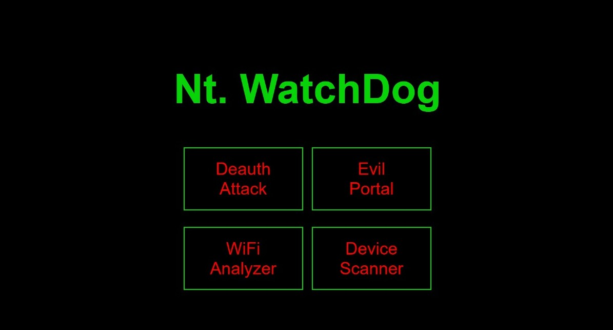
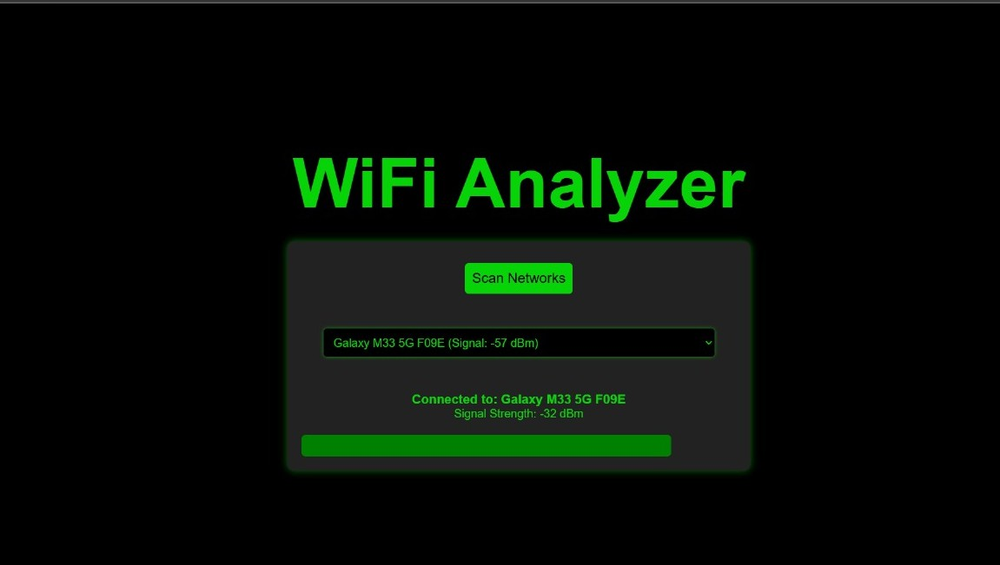
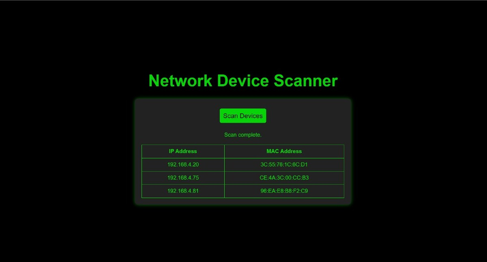
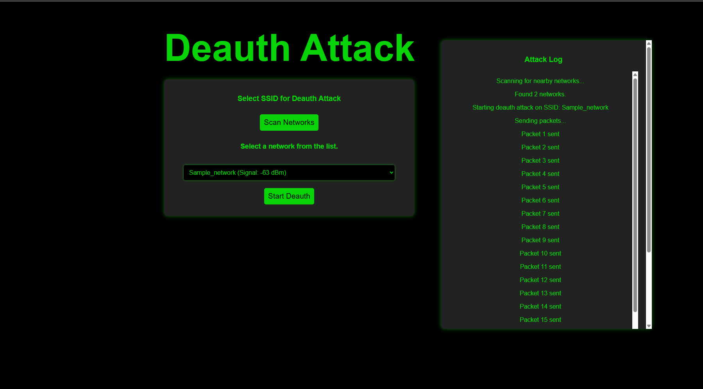
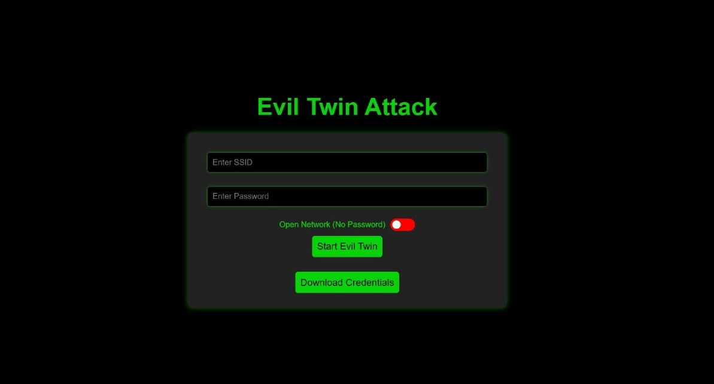

# NT.Watchdog - IoT-Enabled WiFi Network Testing Tool

NT.Watchdog is a portable ESP32-powered cybersecurity device designed for WiFi network testing and auditing. It allows you to simulate real-world attacks like deauthentication, Evil Twin, and analyze signal strength of nearby networks — all through a web-based control panel.

---

## Table of Contents

- [Overview](#overview)
- [Features](#features)
- [Components Required](#components-required)
- [Installation and Setup](#installation-and-setup)
- [Usage](#usage)
- [Screenshots](#screenshots)
- [Disclaimer](#disclaimer)

---

## Overview

The NT.Watchdog project enables ethical hackers, researchers, and educators to test the resilience of WiFi networks. By simulating common wireless attacks, this tool helps validate network configurations and client-side security mechanisms such as HSTS, certificate pinning, WPA3, and PMF.

---

## Features

- **WiFi Network Scanner** – Scan and list nearby SSIDs with RSSI levels
- **Signal Strength Analyzer** – Get real-time RSSI values of a target SSID
- **Deauthentication Attack Module** – Simulate WiFi disconnections for testing WPA2/WPA3 PMF enforcement
- **Evil Twin Module** – Create a fake AP with captive portal for phishing/resilience testing
- **Web UI** – Mobile-friendly web interface hosted directly from the ESP32
- **SPIFFS-based Static Hosting** – Serve HTML, CSS, JS from ESP32's internal file system

---

## Components Required

| Component              | Quantity |
|------------------------|----------|
| ESP32 Dev Module       | 1        |
| Rechargeable Battery   | 1        |
| Type-C Charging Module | 1        |
| Microcontroller Cable  | 1        |
| Push Button (optional) | 1        |

---

## Installation and Setup

1. **Install Prerequisites:**
   - [Arduino IDE](https://www.arduino.cc/en/software)
   - ESP32 Board Manager via Boards URL:
     ```
     https://raw.githubusercontent.com/espressif/arduino-esp32/gh-pages/package_esp32_index.json
     ```

2. **Install Required Libraries:**
   - `WiFi.h`
   - `WebServer.h`
   - `SPIFFS.h`
   - `ArduinoJson.h`


3. **Clone this Repository:**
   ```bash
   git clone https://github.com/your-username/NT-Watchdog.git
   cd NT-Watchdog


4. **Add Web Interface Files to ESP32 (SPIFFS)**
   -Place your web UI files (`index.html`, `style.css`, `script.js`, etc.) inside a folder named `data` in the same directory as your `.ino`
   file:
   ```bash 
    NT-Watchdog/
    ├── NT_Watchdog.ino
    └── data/
        ├── index.html
        ├── style.css
        └── script.js

   
6. **Install the ESP32 SPIFFS Uploader Tool**
   1. Download from: [ESP32 SPIFFS Uploader GitHub](https://github.com/me-no-dev/arduino-esp32fs-plugin)
   2. Place the tool in: ``` Arduino/tools/ESP32FS/tool/esp32fs.jar ```
   3. Restart the Arduino IDE. 4. Go to `Tools → ESP32 Sketch Data Upload` to upload SPIFFS files to ESP32.


7. **Upload the Code to ESP32**
   1. Open `NT_Watchdog.ino` in the Arduino IDE.
   2. Select board: `ESP32 Dev Module`
   3. Choose the correct `COM Port`
   4. Click the `Upload` button (→)
   5. After upload, open the **Serial Monitor** (115200 baud) to check logs.


8. **Access the Interface**
   1. Connect to WiFi: `NT_Watchdog`
   2. Open your browser and go to: [http://192.168.4.1](http://192.168.4.1)
  
## Usage

- **Wi-Fi Network Security Testing**  
  Perform essential penetration testing tasks like deauthentication and Evil Twin attacks to assess the resilience of wireless networks.

- **Client-Side Security Validation**  
  Evaluate how devices and browsers handle rogue APs, fake login portals, and invalid HTTPS certificates (e.g., HSTS, certificate pinning).

- **Educational & Research Purposes**  
  Learn and demonstrate how common Wi-Fi attacks work in a controlled lab environment.

- **Security Awareness Demonstrations**  
  Show real-time network spoofing and phishing simulations to raise awareness about unsecured Wi-Fi networks.

- **Signal Strength & Network Scanner Tool**  
  Analyze nearby Wi-Fi networks, their signal strengths (RSSI), and SSID presence without connecting.

## Screenshots
- **Dashboard / Home Page:**
  

- **Signal Strength Analyzer Module:**
  

- **WiFi Network Scanner Module:**
  

- **Deauthentication Attack Module:**
  

- **Evil Twin Module:**
  

## Disclaimer
This project is intended solely for educational and authorized penetration testing purposes. Unauthorized usage on networks you do not own or have explicit permission to test is illegal and unethical.

